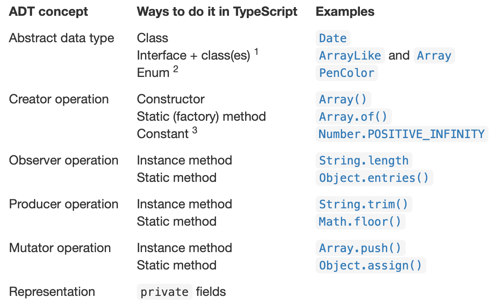

# 抽象数据类型

抽象数据类型解决了一个危险的问题: 用户会假设数据的内在类型.

下面是一个访问控制的例子:
```ts
      class Wallet {
          private amount: number = 0;

          public loanTo(that: Wallet): void {
/*A*/         that.amount += this.amount;  // 这里可以访问到that, 任何在Wallet内的代码都可以处理private的内容
/*B*/         amount = 0;  // 报错, ts必须显式指定
          }
      }

      class Person {
          private w: Wallet;

          public getNetWorth(): number {
/*C*/         return this.w.amount;  // 报错, 无法访问私有变量
          }

          public isBroke(): boolean {
/*D*/         return Wallet.amount === 0;  // 报错, 无法访问私有和实例变量
          }
      }


      function main(): void {
/*E*/     const w = new Wallet();
/*F*/     w.amount = 100;  // 报错
/*G*/     w.loanTo(w);  // 不会报错 允许自我调用
      }

      main();
```

## 抽象类型是什么

抽象数据类型是软件工程的一个通用准则，其包括：
- 抽象 Abstraction，忽略了低层次的细节，比如spec
- 模块化 Modularity，将系统分割为数个部分和模块，比如unit testing和spec的组合
- 封装 Encapsulation，将模块保护起来，不会受影响其它部分的bug影响，比如函数内部的局部变量
- 信息隐藏 Information hiding，隐藏模块的细节，因此可以将模块升级并不影响系统的其它部分，比如spec
- 分割责任 Separation of concerns，一个模块一个功能，比如一个条理清晰的spec

### 用户定义的类型

抽象类型是软件开发的一个重要进步，即可以允许用户自定义类型。自定义类型的特点是使用者无需关心它的值是实际如何存储的，只需要关注**运算方法**。

## 区分类型和运算

类型无论是内部还是用户定义的，都可以分为可修改和不可修改。可修改类型意味着通过运算可以直接在同一个对象上产生新的结果，如日期类型Date。而不可修改，如string，只能通过运算产生完全新的string。

运算分为如下几类：
- Creators 产生新的对象。
  - 构造器 constructor，如new Date()
  - 静态方法 如Array.of()
- Producers 产生新对象，需要一个或多个已存在的对象作为输入
  - concat产生新的string
- Observers 接受抽象类型并返回不同类型的对象
  - 如size，get
- Mutators 修改对象
  - 如 push，add

### 抽象数据类型的例子

number，ts的原始数字类型。不可修改因此没有mutators。包含：
- creators 0，1，2等
- pro + - 等
- obs 比较运算符 === 等

Array为可修改：
- creators [], Array.of, Array.from
- pro Array.concat
- obs length, [..] indexing
- mut push pop shift

string不可修改：
- creators constructor, "text", String.fromCharCode
- pro concat, substring, toUpperCase
- obs length

当然在更复杂的类型中，可能有函数同时充当pro和mut的地位。

## 抽象类型由其运算定义

正如标题所言，如Array，我们知道其不是链表，不是哈希表，而是带有[..]索引，push方法，length属性的数组。沿用spec中防火墙的概念，这里抽象类型隐藏了相关函数（运算）和共享的数据。

反过来说，运算组成了抽象。类包含了复杂的数据结构，组成了representation。

## 设计一种抽象类型

- 设计时要考虑精简的运算
- 每一种运算要条理清晰，比如不应该给Set增加sum函数
- 运算要充分，能够保证提供足够的功能。比如string需要索引来提供字符。string要有length而不是让用户循环i直到获取到undefined
-  类型可以泛化，也可以专一某种情况（如员工数据库）。但是不要将两者混在一起。比如Deck类型不需要add将int和string加入其中。


## 表征（Representation）独立

表征，即实际用来实现该抽象类型的数据结构或数据域，应当独立。这意味着这些实现用的数据结构在发生变动时，不会影响到该抽象类型。比如用Array组建了某新的数据类型后，Array改为使用新的设计（如链表），不会影响外部的抽象类型。

### 例子：对strings的不同表征

在日常的应用中，最简单的例子是采用get set函数（C#）。这样当修改实际的数据结构时，不会影响用户部署的用法。

下面是一个自定义的string类：
```ts
/** MyString represents an immutable sequence of characters. */
class MyString { 
    private a: Uint16Array;
    //////////////////// Example creator operation ///////////////
    /**
     * @param s 
     * @returns MyString representing the sequence of characters in s
     */
    public constructor(s: string) { ... }

    //////////////////// Example observer operations ///////////////
    /**
     * @returns number of characters in this string
     */
    public length(): number { ... }

    /**
     * @param i character position (requires 0 <= i < string length)
     * @returns character at position i
     */
    public charAt(i: number): string { ... }

    //////////////////// Example producer operation ///////////////
    /** 
     * Get the substring between start (inclusive) and end (exclusive).
     * @param start starting index
     * @param end ending index.  Requires 0 <= start <= end <= string length.
     * @returns string consisting of charAt(start)...charAt(end-1)
     */
    public substring(start: number, end: number): MyString {
        const that = new MyString("");      // make a temporarily-empty MyString object
        that.a = this.a.slice(start, end);  // ... and immediately replace its array
        return that;
}

    /////// no mutator operations (why not?)
}

```

这里关注substring函数，其新建一个子字符串。

假设用户已经部署了一定的substring函数，因此我们需要保证表征独立，在用户不用修改部署的情况下更新更高效的substring函数。

```ts
class MyString {
    private a: Uint16Array;
    private start: number;
    private end: number;

    public substring(start: number, end: number): MyString {
        const that = new MyString(""); // make a temporarily-empty MyString object
        that.a = this.a;               // ... and immediately replace its instance variables 
        that.start = this.start + start;
        that.end = this.start + end;
        return that;
    }
}

```

更新后，对用户而言看起来没有任何变化，保持了ADT（抽象数据类型）的表征独立。

## 在TS中实现ADT

具体细节如下：



- 使用接口和类定义ADT
- 使用枚举定义ADT，特别适合具有固定集合的值，如星期
- 使用常量对象作为creator，比如在一些不可修改的类型中

## 在TS中测试ADT

对于MyString类型，分割的方案如下：
```ts
// testing strategy for each operation of MyString:
//
// constructor:
//    partition on string length: 0, 1, >1
// length(): 
//    partition on string length: 0, 1, >1
//    partition on this: produced by constructor, produced by substring()
// charAt(): 
//    partition on string length: 0, 1, >1
//    partition on i=0, 0<i<len-1, i=len-1
//    partition on this: produced by constructor, produced by substring()
// substring():
//    partition on string length: 0, 1, >1
//    partition on start=0, 0<start<len, start=len
//    partition on end=0, 0<end<len, end=len
//    partition on end-start: 0, >0
//    partition on this: produced by constructor, produced by substring()
```

- 实际分割时可以考虑输入状态`this`
- 按照抽象的string长度来分割，而不是表征的数组a本身（比如最大值都限制在len-1）
- 按照start和end在substring()的输入来分割，而不是在表征中（这里应该指的是start不会大于end，两者都大于零？）
- 代入用户，按照实际的理解来分割
