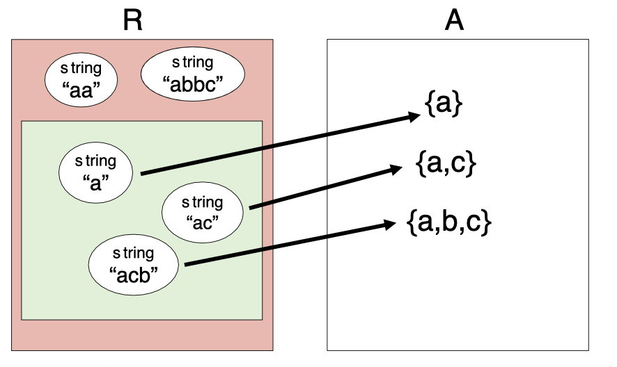
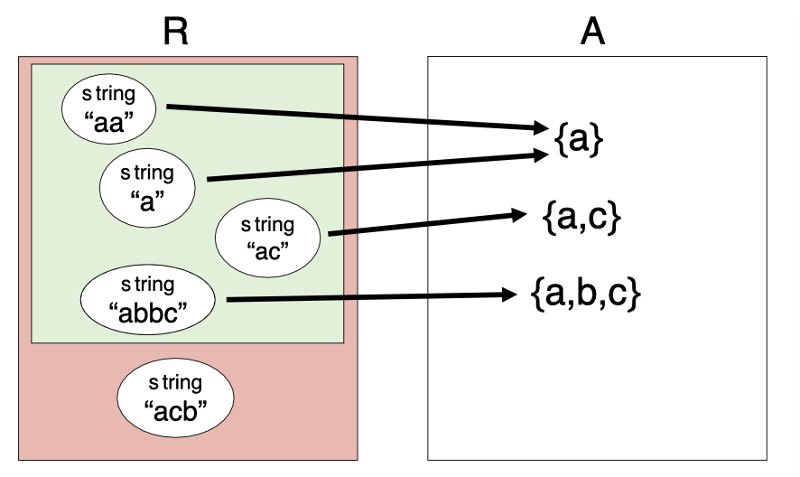

# 抽象函数和表示不变量

抽象函数为抽象数据类型(ADT)提供等号运算操作. 表示不变量(representation invariants)使得更容易捕捉到由数据结构产生的bug.

## 不变量

ADT的一个重要特点就是保存自身的不变量. 目前遇到的不变量有:
- 不可修改的变量
- 变量的类型, 如`i: number`意味着`i`一定是`number`
- 变量的关系, 如循环中的`0 <= i < array.length`

ADT保存不变量可以使得代码更容易被理解和debug.

### 不可修改性

保存不变量可能会由于一下原因而失败:
- ADT内部成员使用了public
- public函数返回了内部成员的直接引用
- set内部成员的value时直接使用了外部的引用

```ts
class Tweet {

    public author: string;
    public text: string;
    public timestamp: Date;

    /**
     * Make a Tweet.
     * @param author    Twitter user who wrote the tweet
     * @param text      text of the tweet
     * @param timestamp date/time when the tweet was sent
     */
    public constructor(author: string, text: string, timestamp: Date) {
        this.author = author;
        this.text = text;
        this.timestamp = timestamp;
    }
}
```

对于这个ADT, 其没有保存好不变量, 因为初始化后外部可以直接通过public访问成员变量. 这种问题又称为表示暴露(representation exposure).

正确写法应该是使用private并添加get()函数作为Observers.

```ts
/**
 * @returns a tweet that retweets t, one hour later
 */
function retweetLater(t: Tweet): Tweet {
    const d: Date = t.getTimestamp();
    d.setHours(d.getHours()+1);
    return new Tweet("rbmllr", t.getText(), d);
}
```

这段代码实现转推, 其没有保存好不变量, 因为`d.setHours`直接把输入参数t的内部成员Date也一起修改了. 主要问题出在`getTimestamp()`函数直接返回了内部参数Date的, 导致产生别名.

正确写法是采用防御性复制, 即返回`new Date(this.timestamp.getTime())`.

```ts
/**
 * @returns an array of 24 inspiring tweets, one per hour today
 */
function tweetEveryHourToday(): Array<Tweet> {
    const array: Array<Tweet> = [];
    const date: Date = new Date();
    for (let i = 0; i < 24; i++) {
        date.setHours(i);
        array.push(new Tweet("rbmllr", "keep it up! you can do it", date));
    }
    return array;
}
```

这段代码实现定时发推, 其没有保存好不变量, 因为Tweet的`constructor`每次直接赋值同一个可变变量到内部成员, 最终导致所有的Tweet时间都是23点.

正确写法是在构造器中也采用防御性复制, 即`this.timestamp = new Date(timestamp.getTime())`.

## 表示不变量和抽象函数

抽象值(abs value)的空间包括为用户设计的数值类型, 如BigInt. 表示值(rep value)包括那些实际部署了抽象值的对象. 比如BigInt由一个包含位数(number)的数组构成. 这些数组就是表示值.

简单来说, 抽象值类似Class而表示值是Class的内部成员. 因此, 表示值会更加复杂.

```ts
class CharSet {
    private s: string;
    ...
}
```

对于这个例子, CharSet为抽象值空间, 内部的实现string为表示值空间.
- 每一个抽象值被映射到一个或多个表示值, 如{a,b,c}这个集合可以由‘abc’‘bac’等表示. 同时这将允许抽象值的运算.
- 不是所有的表示值可以被映射. 比如‘abbc’就不是有效的集合.

但实际考虑时, 不可能完全用映射图表示所有关系, 因此使用:

1.抽象函数
> AF: R → A

其中箭头即为抽象函数, 满足满射而不必为单射.

2.表示不变量将表示值映射到布尔值
> RI: R → boolen

表示不变量即为一种布尔值函数. 对于表示值r来说, 只有当且仅当r被AF映射时, RI(r)才为true. 因此也可以将RI看作一个集合, 这个集合里的值都是AF的定义输入范围. 具体如图所示:



AF和RI都需要注明到代码中

```ts
class CharSet {
    private s: string;
    // Rep invariant:
    //   s contains no repeated characters
    // Abstraction function:
    //   AF(s) = {s[i] | 0 <= i < s.length}
    ...
}
```

一个普遍的误区是认为AF和RI都由表示和抽象值的空间决定. 实际并非如此, 因为表示值可以有很多种选择, 比如string可以被bit vector代替. 关键点是, 就算同一个表示值空间, 通过不同的选择和理解, 可以改变RI. 

比如对于上述的例子, 我们可以改为允许string内部有重复, 但是要求有序以达到二分查找跳过重复内容. 此时仍然是同一个表示值空间, 但是RI被改变了:

```ts
class CharSet {
    private s: string;
    // Rep invariant:
    //   s[0] <= s[1] <= ... <= s[s.length-1]
    // Abstraction function:
    //   AF(s) = {s[i] | 0 <= i < s.length}
    ...
}
```



当然也可以在同一个表示值空间内,实现不同的AF理解, 这也会改变RI:

```ts
class CharSet {
    private String s;
    // Rep invariant:
    //   s.length is even
    //   s[0] <= s[1] <= ... <= s[s.length-1]
    // Abstraction function:
    //   AF(s) = union of { c | s[2i] <= c <= s[2i+1] }
    //           for all 0 <= i < s.length/2
    ...
}
```

此时AF每两个string作为一对, 这两个字母之间的所有字母作为set的一部分.

**总而言之**, 重要的是部署ADT时不仅仅是决定表示值和抽象值空间, 还要考虑那些表示值合法(RI)并如何将其转化为抽象值.(AF)

### 例子: 有理数

```ts
class RatNum {

    private readonly numerator: bigint;
    private readonly denominator: bigint;

    // Rep invariant:
    //   denominator > 0
    //   numerator/denominator is in reduced form,
    //       i.e. gcd(|numerator|,denominator) = 1

    // Abstraction function:
    //   AF(numerator, denominator) = numerator/denominator

    /**
     * Make a new RatNum = (n / d).
     * @param n numerator
     * @param d denominator
     * @throws Error if d = 0
     */
    public constructor(n: bigint, d: bigint) {
        // reduce ratio to lowest terms
        const g = gcd(BigInt(n), BigInt(d));
        const reducedNumerator = n / g;
        const reducedDenominator = d / g;

        // make denominator positive
        if (d < 0n) {
            this.numerator = -reducedNumerator;
            this.denominator = -reducedDenominator;
        } else if (d > 0n) {
            this.numerator = reducedNumerator;
            this.denominator = reducedDenominator;
        } else {
            throw new Error('denominator is zero');
        }
        this.checkRep();
    }

}
```

### 检查RI

RI并不只是数学上的概念, 程序应该断言RI来更早的触发bug. 比如上述有理数例子中, 使用了checkRep():

```ts
// Check that the rep invariant is true
private checkRep(): void {
    assert(this.denominator > 0n);
    assert(gcd(abs(this.numerator), this.denominator) === 1n);
}
// 0n 1n是bigint的规则
```

理论上应该在每次创建和修改表示时调用check函数. 这一操作应当由程序设计者来完成.

## 温和的副作用

对于表示值和抽象值空间, 实际上可以允许程序的部署对表示值空间进行调整, 只要保证对应的抽象值不变且维持原有的映射关系即可. 这种被允许的操作称之为**温和的副作用**.

```ts
class RatNum {

    private numerator: bigint;
    private denominator: bigint;

    // Rep invariant:
    //   denominator != 0

    // Abstraction function:
    //   AF(numerator, denominator) = numerator/denominator

    /**
     * Make a new RatNum = (n / d).
     * @param n numerator
     * @param d denominator
     * @throws Error if d = 0
     */
    public constructor(n: bigint, d: bigint) {
        if (d === 0n) throw new Error("denominator is zero");
        this.numerator = n;
        this.denominator = d;
        checkRep();
    }

    /**
    * @returns a string representation of this rational number
    */
    public toString(): string {
        const g = gcd(this.numerator, this.denominator);
        this.numerator /= g;
        this.denominator /= g;
        if (this.denominator < 0n) {
            this.numerator = -this.numerator;
            this.denominator = -this.denominator;
        }
        checkRep();
        return (this.denominator > 1n) ? (this.numerator + "/" + this.denominator)
                                 : (this.numerator + "");
    }
}
```

这段代码通过toString的方法来让没有约分的分数展示同样约分后的效果, 放宽了原有的RI, 显然改变了表示值空间, 而且也会修改已经分配好的表示值. 但由于AF仍然成立, 因此是温和的副作用.

## 书写AF、RI和避免表示暴露

对于AF和RI来说, 精确很重要. RI需要说明实际的区域值合法与否, 且不会提及抽象值的内容. AF则不能采取简单说明(如represents a set of characters), 应当能让具体值代入其解释中, 比如上述例子中可以将一个具体例子代入成`AF("abbc") = { "abbc"[i] | 0 <= i < "abbc".length } = { 'a', 'b', 'c' }.`

另一个需要注意说明的是程序的部署如何避免表示暴露. 具体例子如下:

```ts
// Immutable type representing a tweet.
class Tweet {

    private readonly author: string;
    private readonly text: string;
    private readonly timestamp: Date;

    // Rep invariant:
    //   author is a Twitter username (a nonempty string of letters, digits, underscores)
    //   text.length <= 280
    // Abstraction function:
    //   AF(author, text, timestamp) = a tweet posted by author, with content text,
    //                                 at time timestamp
    // Safety from rep exposure:
    //   All fields are private;
    //   author and text are Strings, so are guaranteed immutable;
    //   timestamp is a mutable Date, so Tweet() constructor and getTimestamp()
    //        make defensive copies to avoid sharing the rep's Date object with clients.

    // Operations (specs and method bodies omitted to save space)
    public constructor(author: string, text: string, timestamp: Date) { ... }
    public getAuthor(): string { ... }
    public getText(): string { ... }
    public getTimestamp(): Date { ... }
}
```

值的注意的是, timestamp在RI的描述中没有出现, 但是仍然要在表示暴露中强调. 原因是所有的表示值会被映射为抽象值, 必须保持不变性.

### ADT中的规范应该如何描述

在ADT内的函数规范, 应当使用ADT的**抽象值**作为描述对象.

**不应该**提及表示的细节, 应当考虑表示是对用户不可见的. 这也是RI和AF是作为普通的注释放到Class的内部, 而不是外部的TypeDoc的原因.

## ADT不可变代替先决条件

这里我们把规范中的先决条件和ADT结合起来, 可以看到ADT的一种实际应用和效果.

```ts
/**
 * @param set1 is a sorted set of characters with no repeats
 * @param set2 is likewise
 * @returns characters that appear in one set but not the other,
 *  in sorted order with no repeats
 */
static exclusiveOr(set1: string, set2: string): string;

/**
 * @returns characters that appear in one set but not the other
 */
static exclusiveOr(set1: SortedCharSet, set2: SortedCharSet): SortedCharSet;
```

在加入ADT后, 有这些优点:
- 更不容易出bug. 因为把先决条件中的集合转化为了ADT, 此时ADT中的RI以及静态检查就可以发挥效果, 强制性执行条件
- 更容易理解, 因为ADT的名字简单易懂
- 更容易后续修改, 直接调整ADT即可

### 如何建立不变量

不变量应当在整个程序或对象生命周期内为真. 实现这一目标需要:
- 在建立最开始的状态时使得不变量为真
- 确保所有对对象的修改会保持不变量为真

对于ADT, 这代表着:
- creators和producers必须对新对象实例建立不变量
- mutators observers producers必须保持不变量
- 避免表示暴露

## 总结目前为止编写程序需要的步骤

### 写method时

1. 规范. 包括函数签名、先决条件、处理后情况.
2. 测试. 使用系统性的测试
   1. 在部署测试时更新规范
   2. 至少让一个测试失败~, 一般来说在实际部署代码之前就能全部通过的测试套件是不合格的
3. 部署. 完成函数主体.

### 写ADT时

1. 规范, 为数据类型的运算写规范.
2. 测试. 为ADT的运算写测试.
3. 部署.
   1. 选择表示(Rep). 写下private(目前来说, 后续有新的方案)、RI、AF.
   2. 断言RI. 部署checkRep()函数, 并在每次相关的public操作后调用.
   3. 部署运算.

### 写一个程序时

合并上述内容:
1. 选择数据类型. 那些可修改哪些不可修改.
2. 选择函数. 写下main并分出小的步骤.
3. 规范. 为ADT和函数写下规范, ADT操作保持简洁.
4. 测试.
5. 部署简单的方案.
6. 迭代. 后续慢慢提升性能和效率.
