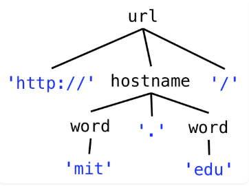
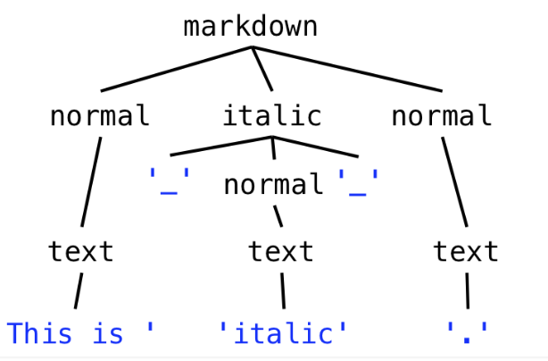

# 语法和解析

_这一课有很多名词, 笔记可能不太准确_, 工作量最大的一集, 最后的左递归问题增加了自己的理解, 不一定正确.

很多程序模块会接收或产生以字节序列或字符序列, 被称为 string (被存储在内存时)或者 stream (输入输出模块时). 具体的讲, 这些序列包含以下几种分类:

- a string
- file on disk, 规范符合某种文件格式
- messages sent over a network, 规范符合网络协议
- command, 规范符合命令行接口

对于这些序列, 本课介绍语法的记号, 用以区分合法和非法的序列, 同时支持解构为数据结构用于代码中. 本课还将介绍一种特别形式的语法, 即正则表达式(regular expression), 其已经被广泛的用到字符串处理中. 最后还会介绍解析器生成器(parser generators).

## 语法 / 文法

为了区分一个 string 是字节、字符数组、或者其他集合中的记号, 我们使用一种集中的表示, 即*语法*来实现区分.

语法定义的合法 string 的集合为*语言*(language). 这里我们介绍一个 URLs 语法的例子. 语法中包含两个部分:

- _终端符_(terminals), 为语法中字面的字符串, 它们无法再进行扩展, 比如'http' ':'
- _非终端符_, 能够匹配的一组字符串, 可以被扩展. 而非终端符的内容被*产生式*(production/rules)所决定, 产生式规定了一个非终端符如何由其他非终端符、操作符或终端符组合构成。每个语法是产生式、规则的集合.

一个产生式在语法中的形式为`nonterminal ::= expression of terminals, nonterminals, and operators `. 其中有一个非终端符会被定义为`root 或者 start 或 S`. 语法认可的字符串集合也会匹配这个 root 非终端. 以下是一个单独集合的例子, 只允许一个 URL:

`url ::= 'http://mit.edu/'`

### 语法操作符(operators)

产生式使用操作符来结合终端符和非终端符, 下面是三个最终要的操作符:
重复(Repetition), 用`*`表示:
`x ::= y* // 重复运算允许一个模式出现零次或多次`
连接(Concatenation), 用空格表示:
`x ::= y z // 连接运算将两个模式按顺序组合在一起, z跟随在y后`
联合(Union), 用`|`表示, 要注意`|`不一定只匹配一个字符, 而是前后的完整模式:
`x ::= y|z // 表示可以匹配其中任意一个模式, 如匹配y或者z`

其优先级为依次降低, 因此有如下运算:

```
m ::= a (b|c) d      // m matches a, followed by either b or c, followed by d
x ::= (y z | a b)*   // x matches zero or more yz or ab pairs
```

现在我们可以用操作符来定义一个域名匹配规则:

```
url ::= 'http://' hostname '/'
hostname ::= 'mit.edu' | 'stanford.edu' | 'google.com'
```

稍作修改, 用操作符来定义一个合法的域名输入规则:

```
url ::= 'http://' hostname '/'
hostname ::= word '.' word
word ::= letter*
letter ::= ('a' | 'b' | 'c' | 'd' | 'e' | 'f' | 'g' | 'h' | 'i'
                | 'j' | 'k' | 'l' | 'm' | 'n' | 'o' | 'p' | 'q'
                | 'r' | 's' | 't' | 'u' | 'v' | 'w' | 'x' | 'y' | 'z')

// 上面的hostname可以为“.”, 显然不合理, 简单的改进如下
word ::= letter letter* // 要求单词必须有一个字母
```

### 更多语法操作符

这些额外的操作符等价于上述三种操作符的组合
可选操作符, 用`?`表示, 表示出现 0 次或 1 次:

```
x ::= y?       // an x is a y or is the empty string
               //    equivalent to x ::=   | y
               //                        ^--- note the empty string here
```

一次或多次操作符, 用`+`表示, 表示至少出现 1 次:

```
x::= y+       // an x is one or more y
              //    equivalent to  x ::= y y*
```

精确数量操作符, 用`{n}`表示, 范围次数使用`{n,m}`,` {n,}`, or `{,m}`:

- {n,m}: 出现 n 到 m 次
- {n,}: 至少出现 n 次
- {,m}: 最多出现 m 次

```
x ::= y{3}     // an x is three y
               //    equivalent to x ::= y y y

x ::= y{1,3}   // an x is between one and three y
               //    equivalent to x ::= y | y y | y y y

x ::= y{,4}    // an x is at most four y
               //    equivalent to x ::=   | y | y y | y y y | y y y y
               //                        ^--- note the empty string here

x ::= y{2,}    // an x is two or more y
               //    equivalent to x ::= y y y*
```

字符类操作符:

- 用`[...]`匹配方括号内的任意单个字符串, 如`x ::= [aeiou]`表示 aeiou 五个字符
- 用`[-]`连字符表示字符范围, 如`[a-z]`表示所有小写字母, 也可以用`x ::= [a-ckx-z]`
- 用`[^...]`表示取反字符类, 匹配任意不在括号内的字符, 如`[^0-9]`匹配任何非数字字符

现在可以对 url 的匹配做优化:

```
url ::= 'http://' hostname '/'
hostname ::= word '.' word
word ::= [a-z]+
```

### 语法的递归

域名实际会多于两个 word, 比如端口 `http://didit.csail.mit.edu:4949/`, 因此改进为递归的语法:

```
url ::= 'http://' hostname (':' port)? '/'
hostname ::= word '.' hostname | word '.' word
port ::= [0-9]+
word ::= [a-z]+

// 但其实也可以不用递归, 改为单纯的循环
hostname ::= (word '.')+ word
```

另外, 端口实际上范围限制在 0~65535, 因此后续仍然需要进一步改进

## 语法解析树(Parse Tree)

用语法匹配具体字符串的过程生成一棵语法解析树, 可以显示字符串是如何匹配到对应的语法部分.

- 解析树的叶子节点为终端符, 包含实际的词汇或符号, 不再能拓展, 如`url ::= 'http://mit.edu/'`中字符串`'http://mit.edu/'`为叶子结点, `url ::= 'http://' hostname '/'`中的`'http://'`为叶子结点, 也是终端符
- 内部节点为非终端符, 其子节点必须为语法中产生式的规则, 比如`hostname ::= word '.' word`的 hostname 内部节点会有三个孩子,` word, ., word`
- 根节点为语法结构的起始符号, 如 url

下图是一个语法解析树(匹配 url)的例子:



### 例子 markdown

```
markdown ::= ( normal | italic ) *
italic ::= '_' normal '_'
normal ::= text
text ::= [^_]*
```

用于表示 markdown 的斜体规则, 对应语法解析树为:



## 正则表达式 (Regular expressions)

通过将上面的非终端符替换, 就可以得到 root 在左, 终端符和操作符在右的单个产生式.

```
url ::= 'http://' ([a-z]+ '.')+ [a-z]+ (':' [0-9]+)? '/'
markdown ::= ([^_]* | '_' [^_]* '_' )*
```

然而也有部分情况无法完全将非终端符替换, 如 html 下的斜体规则:

`html ::= ( [^<>]* | '<i>' html 'i>' )*`

将这种单个产生式再进一步压缩, 只取右边的式子, 删除连接操作符(空格)和终端符的引号, 即得到**正则表达式**(简称 _regexes_).

`([^_]*|_[^_]*_)*`

不同的编程语言基本上都有支持正则表达式的库(而不是支持语法), 这些库会结合`\`做一些简化的写法:

```
. // 匹配所有单个字符(有时不包括换行符), 重要, 容易和句号混淆
\d  // 匹配任意一个数字 等价 [0-9]
\s  // 匹配任意一个空格字符, 包括 space, tab, newline
\w  // 匹配任意一个字母包括下划线, 等价 [a-zA-Z_0-9]

\n  // 匹配换行符
\t  // 匹配tab
```

`\.  \(  \)  \*  \+  \|  \[  \]  \\` 用于表示 char, 与操作符作区分, 也可以用`[]`进行区分, 如`[.] [(]`

此时可以把域名的正则表达式写作`http://([a-z]+\.)+[a-z]+(:[0-9]+)?/`

再补充一些操作符:

- `^(xxx)`表示匹配以 xxx 开头的内容
- `(xxx)$`表示匹配以 xxx 结尾的内容, 可以与`^`结合

正则表达式的练习网站:

- [Crosswords](https://regexcrossword.com/)
- [Regex101](https://regex101.com/) 方便查看表达式的匹配情况

### 在实践中使用正则表达式

在 ts/js 中, 正则表达式直接用`/.../`来区分一般字符串`"..."`, 用法[参考](https://developer.mozilla.org/en-US/docs/Web/JavaScript/Reference/Global_Objects/RegExp), 但有的其他语言并不做区分(如 python).

ts 的正则表达式默认只匹配第一个有效字符串, 可以在后续增加`/g`全局修饰符, 查找所有匹配项:

`const singleSpacedString = s.replace(/ +/g, " ");`

匹配特定 url 字符串:

```ts
if (s.match(/http:\/\/([a-z]+\.)+[a-z]+(:[0-9]+)?\//)) {
  // then s is a url
}
```

利用命名组(named capturing groups)来简化字符串的提取:

```ts
const s = "2020-03-18";
const regex = /(?<year>\d{4})-(?<month>\d{2})-(?<day>\d{2})/;
const m = s.match(regex);
if (m) {
  assert(m.groups);
  const year = m.groups.year;
  const month = m.groups.month;
  const day = m.groups.day;
  // m.groups.name is the part of s that matched (?<name>...)
}
```

具体方法是, 在括号后用`?`标记, 表明括号内并非组合, 而是特定的命名组, 如`<year>`. 随后针对提出的字符串, 可以直接用命名组的名字获取对应量.

### 上下文无关语法 (Context-free grammars)

通常来说, 可以被本课所学语法表示的语言都是上下文无关的. 并非所有上下文无关语言都是正则语言. 一些语法无法简化为单一非递归产生式, 比如这课中的 html 语法. 具有嵌套结构的语言一般为上下文无关, 但不是正则的.

### 小结

- 语法: 一组字符串, 它们使用以`nonterminal ::= expression of terminals`为格式的产生式, 和非终端符、操作符
  - 最重要的三个操作符: `1. * 2.   3. |`
  - 语法有助于区分有意义的字符串和无意义的字符串
- 解析树: 形容字符串如何匹配语法的图表
- 正则表达式: 单个表达式的精简版正则语法

## 解析器生成器(parser generators)

顾名思义, 解析器生成器将语法转换成解析器, 而解析器尝试将字符串输入匹配对应的语法. 解析器通常会生成一棵解析树. 解析的最后一步是将解析树转换为递归抽象数据类型（Recursive ADT）的实例(具体解释在后续小结中). 递归数据类型时常用于在语言中代表表达式(expressions), 包括 HTML, Markdown, TS 等, 这种代表语言表达式递归数据类型是抽象语法树 (Abstract Syntax Tree, AST).

### ParserLib 语法

本课程中使用[ParserLib](https://web.mit.edu/6.102/www/parserlib/4.0.1/typedoc/), 由 staff 为 TS 开发的解析器生成器. 其规则与上述的语法非常类似.

比如 HTML 语法用 ParserLib 表达如下:

```
html ::= ( italic | normal ) * ;
italic ::= '<i>' html 'i>' ;
normal ::= text ;
text ::= [^<>]+ ;  /* represents a string of one or more characters that are not < or > */
```

其主要区别为:

- 空格不敏感
- 非终端符的大小写不敏感
- 合法字符串必须用引号标记, 如`('alpha'|'beta'|[c-z])*`

### 空格

考虑一段这样的语法:

```
expr ::= sum ;
sum ::= primary ('+' primary)* ;
primary ::= constant | '(' sum ')' ;
constant ::= [0-9]+ ;
```

其无法匹配任何带有空格的式子, 显然不合理, 因此需要增加空格的表示, 即:

```
sum ::= primary (whitespace* '+' whitespace* primary)* ;
whitespace ::= [ \t\r\n]+ ;
```

但如果全部补上空格的忽略, 会导致语法非常冗杂, 因此可以用到`@skip`方法:

```
// the IntegerExpression grammar
@skip whitespace {
    expr ::= sum ;
    sum ::= primary ('+' primary)* ;
    primary ::= constant | '(' sum ')' ;
}
whitespace ::= [ \t\r\n]+ ;
constant ::= [0-9]+ ;

// equal to
expr ::= whitespace* sum whitespace* ;
sum ::= whitespace* primary whitespace* (whitespace* '+' whitespace* primary whitespace*)* whitespace* ;
primary ::= whitespace* constant whitespace* | whitespace* '('  whitespace* sum  whitespace* ')' whitespace* ;
```

:warning: 这里 skip 的是空格, 但也可以替换为其他想要跳过的内容, 比如标点符号. 另外就是 constant 不被包括在 skip 范围内, 防止出现数字之间包含空格的情况.

### 生成解析器

后续的内容为使用 ParserLib 库的相关操作.

使用模版字符串(backquotes)输入语法:

```ts
const grammar: string = `
  @skip whitespace {
      expr ::= sum;
      sum ::= primary ('+' primary)*;
      primary ::= constant | '(' sum ')';
  }
  constant ::= [0-9]+;
  whitespace ::= [ \\t\\r\\n]+;  // <-- note that backslashes must be escaped here, because this regex is inside a string
`;
```

用枚举类型定义非终端符和 root, 并生成解析器:

```ts
import { Parser, ParseTree, compile } from "parserlib";

enum IntegerGrammar {
  Expr,
  Sum,
  Primary,
  Constant,
  Whitespace,
}

const parser: Parser<IntegerGrammar> = compile(
  grammar,
  IntegerGrammar,
  IntegerGrammar.Expr
);
```

### 调用解析器

```ts
const parseTree: ParseTree<IntegerGrammar> = parser.parse("54+(2+ 89)");
console.log(parseTree.toString());
```

### 遍历解析树

解析树的接口如下:

```ts
interface ParseTree<NT> {
  /**
   * The nonterminal corresponding to this node in the parse tree.
   */
  name: NT;

  /**
   * The children of this node, in order, excluding @skipped subtrees
   */
  children: ReadonlyArray<ParseTree<NT>>;

  /**
   * The substring of the original string that this subtree matched
   */
  text: string;

  /**
   * Get the children that correspond to a particular production rule
   * @param name Name of the nonterminal corresponding to the desired production rule.
   * @returns children that represent matches of name's production rule.
   */
  public childrenByName(name: NT): ReadonlyArray<ParseTree<NT>>;
}
```

可以采用递归函数访问树节点(深度优先):

```ts
/**
 * Traverse a parse tree, indenting to make it easier to read.
 * @param node   parse tree to print.
 * @param indent indentation to use.
 */
function printNodes(node: ParseTree<IntegerGrammar>, indent: string): void {
  console.log(indent + node.name + ":" + node.text);
  for (const child of node.children) {
    printNodes(child, indent + "  ");
  }
}
```

比如对于字符串`54+(2+ 89)`, 可展开为:

```
Expr:54+(2+ 89)
  Sum:54+(2+ 89)
    Primary:54
      Constant:54
    Primary:(2+ 89)
      Sum:2+ 89
        Primary:2
          Constant:2
        Primary:89
          Constant:89
```

### 构建抽象语法树

回顾一下上一课中的递归数据类型:

```
IntegerExpression = Constant(n: number)
                  + Plus(left: IntegerExpression, right: IntegerExpression)
```

当一个递归数据类型用这种方式表示语言时, 有时也可以称作抽象语法树. 而前面用具体语法表示的`IntegerExpression`更加具体, 描述了每一个实际的字符, 因此又被称为具体语法树. 比如, `2+2, ((2)+(2)), 0002+0002`都是具体的语法树, 都对应一棵抽象语法树`Plus(Constant(2), Constant(2))`.

下面利用递归和`parseTree.name`的类型判断, 将具体语法树转换为抽象语法树:

```ts
/**
 * Convert a parse tree into an abstract syntax tree.
 *
 * @param parseTree constructed according to the IntegerExpression grammar
 * @returns abstract syntax tree corresponding to parseTree
 */
function makeAbstractSyntaxTree(
  parseTree: ParseTree<IntegerGrammar>
): IntegerExpression {
  if (parseTree.name === IntegerGrammar.Expr) {
    // expr ::= sum;
    return makeAbstractSyntaxTree(
      parseTree.children[0] ?? assert.fail("missing child")
    );
  } else if (parseTree.name === IntegerGrammar.Sum) {
    // sum ::= primary ('+' primary)*;
    const children = parseTree.childrenByName(IntegerGrammar.Primary);
    const subexprs = children.map(makeAbstractSyntaxTree);
    const expression: IntegerExpression = subexprs.reduce(
      (result, subexpr) => new Plus(result, subexpr)
    );
    return expression;
  } else if (parseTree.name === IntegerGrammar.Primary) {
    // primary ::= constant | '(' sum ')';
    const child: ParseTree<IntegerGrammar> =
      parseTree.children[0] ?? assert.fail("missing child");
    // check which alternative (constant or sum) was actually matched
    switch (child.name) {
      case IntegerGrammar.Constant:
        return makeAbstractSyntaxTree(child);
      case IntegerGrammar.Sum:
        return makeAbstractSyntaxTree(child); // for this parser, we do the same thing either way
      default:
        assert.fail(
          `Primary node unexpected child ${IntegerGrammar[child.name]}`
        );
    }
  } else if (parseTree.name === IntegerGrammar.Constant) {
    // constant ::= [0-9]+;
    const n: number = parseInt(parseTree.text);
    return new Constant(n);
  } else {
    assert.fail(`cannot make AST for ${IntegerGrammar[parseTree.name]} node`);
  }
}
```

当 grammar 存在写法错误时, 通常会导致编译错误(ParseError).

### 左递归和其他 ParserLib 的局限

因为 ParserLib 为递归下降解析器, 遇到左递归就会导致无限循环. 下面是一个左侧递归的例子, 等式右边的非终端符出现在`+`的左侧:

```
sum ::= number | sum '+' number ;
number ::= [0-9]+ ;
```

这里原文中解释较为笼统, 个人理解是此时由于递**归下降解析器的特性**, 会优先考虑匹配最深的情况, 也就是这里递归的情况(尽管有`number`), 故先尝试匹配`sum`, 导致无限递归的发生. 反观上面提到的一个例子:

```
@skip whitespace {
    expr ::= sum;
    sum ::= primary ('+' primary)*;
    primary ::= constant | '(' sum ')';
}
```

这里的`primary ::= constant | '(' sum ')';`, 看似会优先考虑递归的情况(即`sum`), 但是`sum`前面的左括号作为一个进行递归的条件, 可以有效防止无限循环.

同时也要小心间接导致的左递归问题, 比如:

```
sum ::= number | thing number ;
thing ::= sum '+' ;
number ::= [0-9]+ ;
```

简单的解决思路是用`*`代替`sum`:

```
sum ::= (number '+')* number ;
number ::= [0-9]+ ;
```

上面提到了归下降解析器的特性, 其另一个特性为贪心算法(感觉其实是同一个). ParserLib 会尽可能的在每一个点上匹配最长的字符串, 比如:

```
g ::= ab threeb ;
ab ::= 'a'*'b'* ;
threeb ::= 'bbb' ;
```

对于`aaaabbb`, 算法实际匹配了 ab, threeb 是没有匹配的.
