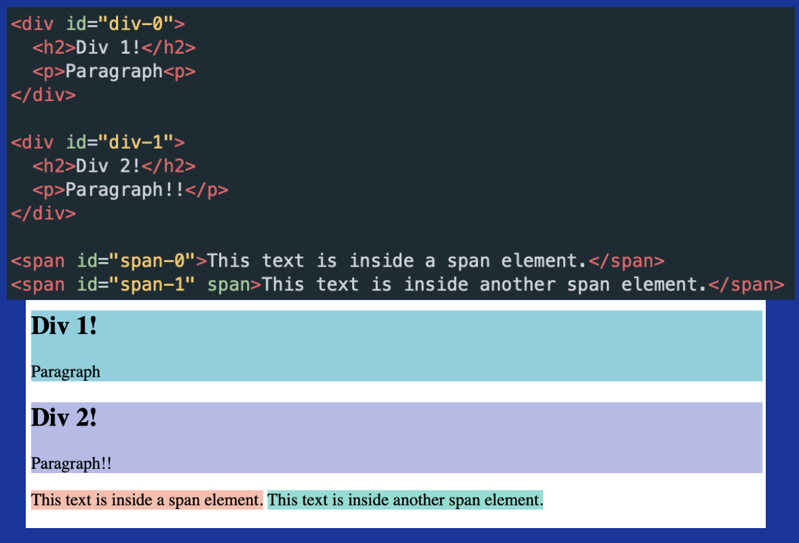
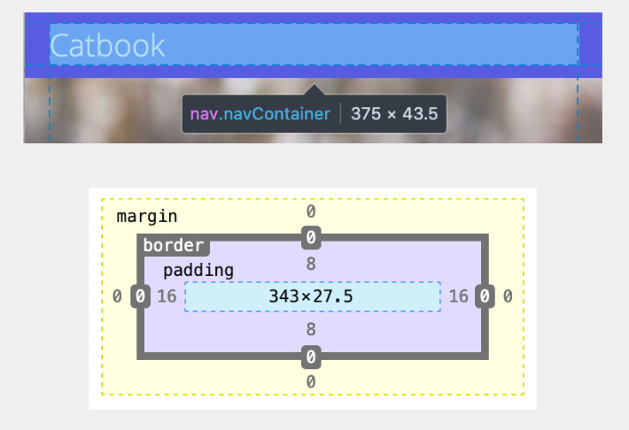

# Web 基础

对应课程单元:

- Kickoff
- Intro to HTML/CSS
- W0 workshop 实战
- 11 APIs / Promises

## 访问网页的简单流程

1. 用户发起*请求*(Request) GET facebook.com
2. 服务器接受, 返回(Respond)_网页文件_
3. 用户在浏览器中显示网页

其中网页文件包括:

- HTML 组织内容
- CSS 组织风格
- JS 实现交互的代码文件
- 一些 Assets, 如图片

每次发起的请求实际是 HTTP(Hypertext Transfer Protocol) Request, 包含:

- 请求目标(URL)和参数, 比如目标(https://www.youtube.com/results?)参数(search_query=web+lab)
- Http 方法, 描述希望的行动, 包括 **GET/POST**(获取/发送数据), PUT(代替数据), DELETE
- Headers, 提供 http 请求的背景, 比如使用的语言、浏览器、host 等等
- Body

服务器的 Respond 包括:

- status code, 404😭(4xx 你有一些 wrong), 500👎(5xx 服务器有一些 wrong), 200👌(成功), 3xx 重定向 等
- headers, content-length、type 等关于返回的信息
- body, 通常是 json 格式, 如果请求是用户提交的数据, 则为与之相关的信息

### APIs

即 Application Program Interface, 为允许发送请求的端口(endpoints)的集合

API 有着如下目的:

- 提供数据访问
- 直接访问服务器的数据会导致不方便和安全问题
- 提供结构化端口
- 分工

一个 API 接收(**URL, 序列参数**)和返回的例子:

- GET /api/add
  - Input: {a: number, b: number}
  - Output: {result: number}
- GET /api/add?a=5&b=8
  - {result: 13}

Endpoints

- 访问 URL 实际是发送请求给端口
- 一个 URL 可以支持多个端口
- 很多外部的 API 提供商会要求 key/token 来提供收费服务, 密钥存储在请求中

一些 debug API 请求的工具, 如 postman, REQBIN.

JS 中在发起 GET 请求后, 可能会返回一个**Promise**, 代表 JS 异步操作的对象:

- 包含 pending, fulfill, reject 三种状态
- 代表异步操作的最终结果
- 引入异步操作作为结果, 实际是因为 API 的处理需要时间, 此时 JS 可以继续执行

一个 Promise 的处理例子, fulfill 则执行 then, 否则抛出错误并 catch

```js
fetch("https://api.example.com/data")
  .then((response) => response.json())
  .then((data) => {
    console.log(data);
  })
  .catch((error) => {
    console.error(error);
  });
```

### 网页路由(routing)

路由是一种将 URL 路径映射到对应页面内容的机制, 具有以下特点, 实现页面之间的无刷新跳转.

比如使用 Reach Router library 可以实现:

```jsx
<Router>
  <Home path="/" />
  <Dashboard path="dashboard" />
  <Team path="/team" />
</Router>
```

对应 URL `"/" "/dashboard" "/team"`下的不同渲染内容. 其中`dashboard`前没有`/`, 代表相对路径, 直接加在当前 URL 后方, 而带有`/`则为绝对路径, 接在根路径下.

实现跳转功能时, 使用`<Link to="..."></Link>`, 会被渲染为 html 的链接跳转形式.

## HTML

= Hypertext Markup Language, 用于描述网页的**内容和结构**

= Nested Boxes, 实际上是多个框的嵌套和组合

```html
<!DOCTYPE html>
<html>
  <head>
    <title>Title!</title>
    <!-- 网页标题meta信息 -->
  </head>
  <body>
    <h1>Heading!</h1>
    <p>Paragraph!</p>
  </body>
</html>
```

### Tags

| Tag                   | 作用                       |
| --------------------- | -------------------------- |
| `<html>`              | Root of HTML Document      |
| `<head>`              | Info about Document        |
| `<body>`              | Document Body              |
| `<h1>, <h2>, <h3>, …` | Header tags                |
| `<p> `                | Paragraph tag              |
| `<div> `              | Generic block section tag  |
| `<span>`              | Generic inline section tag |

#### 属性

`<tagname abc="xyz"> </tagname>` 其中`abc`为属性, `"xyz"`为属性的值.

如插入链接:

`<a href="http://weblab.mit.edu"> Content </a>`

插入图片:

`</img>`

或者无需文字版本 ``

#### Lists

- `<ol>` 有序
- `<ul>` 无序
- `<li>` Item

```html
<ol>
  <li>Test</li>
  <li>A List Created by HTML</li>
</ol>
```

#### div & span

主要用于将内容归类成一个组, div 用于大段, span 为行间.



对于各种 tag 的使用和细节, 查一查 MDN 或者问 GPT~

为什么不直接广泛的使用 div ?

- MDN 给出的建议 `只有在其它语义内容(<article> / <nav>)都不合适时才使用`
- 语义内容的使用有助于机器更容易读懂网页的内容, 有助于人的理解和维护

## CSS

= Cascading Style Sheets, 告诉浏览器内容长什么样

= A list of description, for makeup

下面的例子装饰 div 内容的风格

```css
div {
  color: red;
  font-family: Arial;
  font-size: 24pt;
}
```

可以使用 id 或者 class 来指定特定的 tag 被 css 装饰.

```css
.classInfo {
  ...;
}

#idName {
  ...;
}
```

### ID and Class

| 特性               | ID                  | Class                     |
| ------------------ | ------------------- | ------------------------- |
| 唯一性             | 在页面中必须唯一    | 可以重复使用              |
| 用途               | 标识特定元素        | 分组相似元素              |
| 每个元素可使用数量 | 只能使用一个        | 可以使用多个              |
| CSS 权重           | 较高 (100)          | 较低 (10)                 |
| 示例               | `<div id="header">` | `<div class="container">` |

CSS 中, 优先级从上到下为:

- Inline style (ignore)
- ID (#myID)
- Classes (.info)
- Elements (div)

通常**只使用 classes**来配合 css 文件.

### 结合 CSS 到 HTML

```html
<head>
  <title>Title!</title>
  <link rel="stylesheet" href="style.css" />
</head>
```

link 指定 rel(relationship)和文件地址.

### 字体导入

结合谷歌字体实现字体更改

```css
@import url("https://fonts.googleapis.com/css2?family=Open+Sans:ital,wght@0,300..800;1,300..800&display=swap");

body {
  font-family: "Open Sans", sans-serif;
}
```

### Margin/Padding

具体的 margin 和 padding 关系如下:



- 浏览器默认给 body 预留 8pt 的 margin, 需要手动设置为 0
- 8pt grid system: 通常将 margin 等数值设置为 8px 的倍数, 便于判断

在 css 文件中, 可以预设置变量并使用:

```css
:root {
  --primary: #396dff;
  --grey: #f7f7f7;
  --white: #fff;

  --xs: 4px;
  --s: 8px;
  --m: 16px;
  --l: 24px;
}

.exp {
  --backgroud: var(--white);
  margin: var(--xs);
}
```

#### 使用 Padding 划分显示区域

- 使用百分比, 可以在窗口缩放时仍然保持相对的显示位置
- 利用左右的等比例的 padding 来实现居中效果

```css
.avatarContainer {
  padding: 0 35%;
}
```

### flex

flex 用于横向或纵向组织内容块.

```css
.u-flex {
  display: flex; /* 还有其它方式, 如block */
  flex-direction: row;
  align-items: center; /* 实现对齐 */
}

.u-grow {
  flex-grow: 1;
  flex-basis: 0; /* basis需要设置为0使得块的宽度可以被设置为相同 */
}
```
