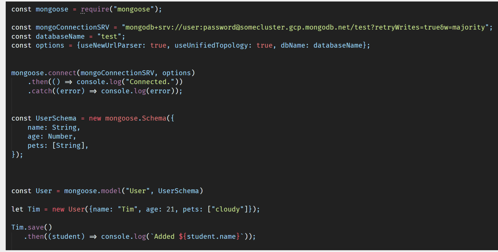
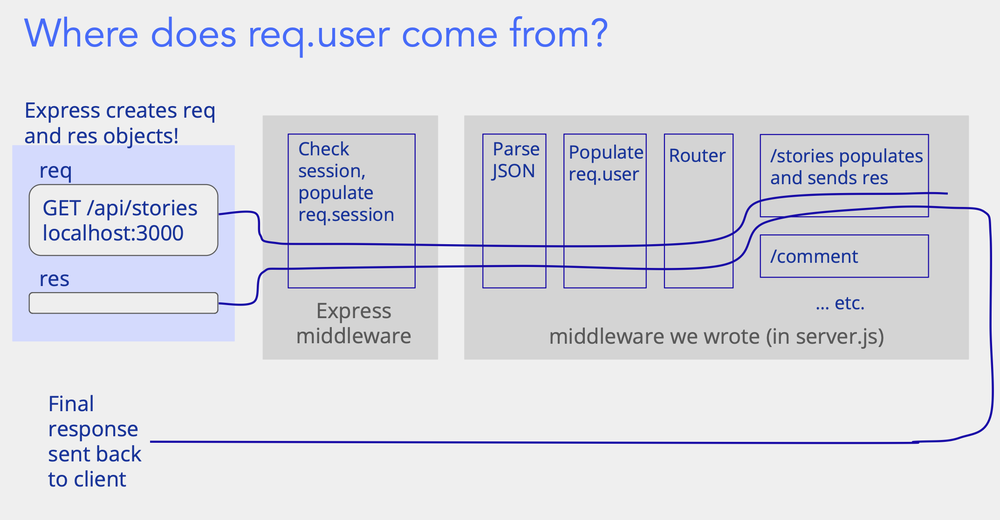

# 项目构建

## 结构

课程前端为 React+JS, 后端则使用 express.js, 使用 Node.js 运行 JS 脚本. 因此库的管理都由 Node 的 package.json 进行.

具体项目结构如下:

- /client 包括所有 React 代码, 组件/页面/utilities 等前端
- /server 包括后端代码
- 其它

## API 端口建立

在 server.js 中使用如下代码即可构建一个相应 GET 请求的 API(实际是一个 route handler)

```js
const app = express();
app.get("/api/test", (req, res) => {
  res.send({ message: "My first API" });
});
```

其中, get 对应 GET 请求, 第一个参数为 API 端口, 第二个参数为对应操作(handler), 其中 req 为请求, res 为返回结果

对端口的定义, 需要从最具体到最广泛, 比如先定义`"/api/test"->"/api/*"`.

### Middleware(中间件)

Middleware(中间件)是一个处理 HTTP 请求/响应的软件层，具有以下特点：

- 位于客户端请求和服务器响应之间(即接受 req 和发送 res 之间)
- 可以检查、修改或拦截 HTTP 请求和响应
- 按照特定顺序串联执行,形成处理管道(依靠 next()传递 REQUEST)
- Route handlers 在中间件的最后面(但也属于中间件)


在 Express 中使用 app.use()注册中间件, 比如`app.use(express.json())`.

也可以自定义中间件处理函数, 其中路径为 optional:

```js
const app = express();
app.use("/time", (req, res, next) => {
  console.log("Time:", Date.now());
  next();
});

app.use((error, req, res, next) => {
  // ...
});
```

next 为调用下一个中间件, 如果空缺则调用默认的下一个. error middlewares 为错误处理用, 定义在所有中间件的**最后**.

### Catch All 端口

用于返回 HTML 和其它 React 相关的文件来提供前端的构建.

```js
const express = require("express");
const path = require("path"); // utilizes for Handling path

const app = express();
const reactPath = path.resolve(__dirname, "..", "client", "dist"); // path for react files
app.use(express.static(reactPath)); // 将指定目录下的文件直接提供给客户端访问

app.get("*", (req, res) => {
  res.sendFile(path.join(reactPath, "index.html")); // 只需返回index作为入口, react代码会解决URL路由
});
```

### API 的组织分类

后端会定义非常多的端口, 端口可以用他们的 API 路由进行区分, 如`"/cat", "/dog"`. 为了分类的清晰, 不要把所有端口都放在 app 内(即 server.js, main- application), 而是利用 router(分组的 API 端口, mini-application).

```text
src/
  ├── routes/
  │   ├── userRoutes.js
  │   ├── productRoutes.js
  │   └── orderRoutes.js
  └── app.js
```

分类后, 在 app 和路由的 js 中分别实现:

```js
// userRoutes.js
const express = require("express");
const router = express.Router();
// ...define middlers and handlers
modules.exports = router;

// app.js
const express = require("express");
const app = express();
const userRoutes = require("./userRoutes");
app.use("/api", userRoutes); // 注意api route, 这里是api, 而userRoutes中不需要接api, 两者组合为总的api route
```

### 请求的处理

对于请求, 需要区分 GET/POST, 两者的参数有区别:

- GET 的参数在 query 中, 使用 req.query.xxx 访问
- POST 参数在 body 中, 使用 req.body.xxx 访问

## 数据库

课程使用 mongodb 作为数据库, 其为一种非 SQL 数据库, 即数据之间以文档(类似 JSON)关系存储. 其他常见的数据库则使用 SQL, 以类似表格的形式存储数据.

MongoDB 结构包含五个部分:

- Instance 多个数据库的集合
- Database 一个数据库, 管理一个网页应用的数据, 如 Catbook
- Collection 相似数据的组合, 如 stories
- Document 一个单个的 JSON 或者 JS 对象, 如 story
- Field 一个 Document 的各个域, 如 content、property

数据库可以运行在服务器上, 相对于后端来说也是运用 APIs 进行数据访问、修改. 这里使用 Mongoose 来负责包装数据和访问数据库. Mongoose 使用 Schema 来管理 Document 的 Fields, 就像 JS 的对象一样, 同时它允许不同的 Document 包含不一样的域.



在向服务器端保存数据后, 会自动生成一个\_id, 作为该 Document 的特定编号.

### 常用操作

- find, 使用`User.find({...})`, `"..."`为`{age: 21}`的特定条件, 可以为空.
- deleteOne + 条件
- deleteMany + 条件

## 账号与验证

前后端会涉及账号的登陆验证和密码管理. 前端通过 POST 将账号和密码发送给后端, 后端通过 DB 进行验证. POST 过程不能使用明文 string 传输, Hash 函数为较好的选择(将 string 单向映射), 再配合 slat added 来存储密码. 但实际上实现存储密码仍然比较困难, 所以可以利用第三方(如谷歌账号登录)来帮助管理.

尽管如此, 在验证登录时还是会有一些问题, 比如如何证明客户端的网页登入谷歌账号了? 如何在后续的请求中确信该客服端已经登录过了? 而且这一切**必须在不信任客户端的情况下完成!**

要解决这个问题, 需要使用`sessions` / `tokens`.

session 为有状态认证方法, 在用户登录后服务器生成 session 信息并将其返回给用户, 存储在 cookie 中. 后续请求携带 cookie 的 sessionID 进行验证.

token 为无状态认证方法, 在用户登录后生成 JWT token, 包括用户信息和签名并返回用户. 后续请求使用该 token 认证, 服务器验证签名和有效期.

在课程中使用了两种方法的组合, 验证流程为:

1. 用户登录谷歌, 获得 JWT(有效时间可能只有 1h)
2. 用户提供 JWT 到后端, 后端向谷歌验证 JWT
3. 合法 JWT 则视为登录成功, 向用户返回 cookie(使用 Set-Cookie 响应 header)
4. 后续使用 cookie 验证登录

其中第三步实际会同步存储在后端的中间件的 session 中, 等价于`req.session.user or req.user`, 直接修改 REQUEST:

```js
// server.js

// 在后端启用session, 记录登录的sessionID
app.use(
  session({
    secret: "session-secret",
    resave: false,
    saveUninitialized: false,
  })
);

// this checks if the user is logged in, and populates "req.user"
app.use(auth.populateCurrentUser);

// auth.js
function login(req, res) {
  verify(req.body.token) // Step 2
    .then((user) => getOrCreateUser(user))
    .then((user) => {
      console.log(`Logged in as ${user.name}`);

      // persist user in the session
      req.session.user = user; // Step 3!
      res.send(user);
    })
    .catch((err) => {
      console.log(`Failed to log in: ${err}`);
      res.status(401).send({ err });
    });
}
```

实际流程图如下:


后续如果前端网页刷新, 不掉登录状态的方法是直接从服务器的`api/whoami `GET`req.user`.
